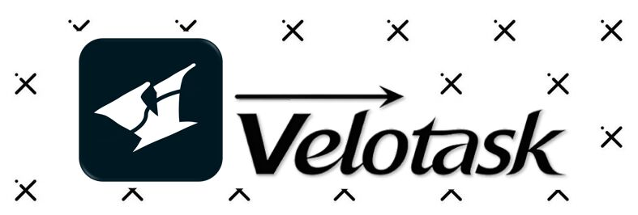

# Velotask

[](LICENSE) [](https://github.com/Source-of-USTB/Velotask/stargazers) [](https://github.com/Source-of-USTB/Velotask/issues) [](https://github.com/Source-of-USTB/Velotask/actions) [](https://flutter.dev)



> Velotask doesn't just help you check off items quickly; it gives your day direction.

中文 | [English](README_en.md)

Velotask 是一款的现代、高效的任务管理应用。

它旨在通过简洁直观的界面帮助您追踪任务进度，截止日期并保持高效。

本项目基于 Flutter 构建。

## ✨ 支持功能

- **📝 任务管理**
  * 添加、编辑、删除任务，滑动标记完成。
  * 三种任务类型：待办事项、截止日期、日期范围。

- **🏷️ 标签与组织**
  * 自定义标签，按标签筛选任务。
  * 设置重要性、开始和截止日期、预估工时。

- **📊 时间线视图**
  * 甘特图风格的时间线，直观展示任务时间跨度。
  * Ctrl/Cmd + 滚轮缩放，今天快速定位。
  * 周末高亮、网格线、红色"此刻"线。

- **🤖 AI 解析**
  * 配置 OpenAI 兼容 API，将自然语言文本解析为结构化任务。
  * 支持一次解析多个任务，自动推断任务类型与日期。
  * 数据仅存储在本地。

- **🎨 个性化**
  * 亮色 / 暗色主题切换。
  * 可视化任务进度、完成动画。
  * 可编辑的配色预设系统（8 组 41 色项，亮暗双模式）。

- **🚀 离线优先**
  * Drift (SQLite) 数据库驱动，数据完全本地存储。

## 🛠️ 技术栈

* **框架**: [Flutter](https://flutter.dev/)
* **语言**: [Dart](https://dart.dev/)
* **数据库**: [Drift](https://drift.simonbinder.eu/) 

<!-- * **通知**: [flutter_local_notifications](https://pub.dev/packages/flutter_local_notifications) + [timezone](https://pub.dev/packages/timezone) -->

---

## 🚀 快速开始

### 前置要求

* 安装 [Flutter SDK](https://docs.flutter.dev/get-started/install)。
* 配置好 Flutter 开发环境的 IDE（VS Code 或 Android Studio）。

### 安装步骤

1. **克隆仓库**

    ```bash
    git clone https://github.com/Source-of-USTB/Velotask.git
    cd velotask
    ```

2. **安装依赖**

    ```bash
    flutter pub get
    ```

3. **运行代码生成器**

    ```bash
    dart run build_runner build
    ```

4. **运行应用**

    ```bash
    flutter run
    ```

## 📦 构建

### Android

构建 Android APK 安装包：

```bash
flutter build apk
```

* **注意**：为了减小特定架构的文件体积，可以使用：

    ```bash
    flutter build apk --split-per-abi
    ```

### Windows

构建 Windows 可执行文件：

```bash
flutter build windows
```

### Others

暂未对其他平台进行验证

## 🤝 贡献

非常欢迎您的贡献！如果您发现任何 Bug 或有新的功能建议，请随时提交 Issue 或 Pull Request。

查看我们的 [开发路线图](docs/ROADMAP.md) 了解未来的开发计划。

1. Fork 本仓库
2. 创建您的特性分支 (`git checkout -b feature/AmazingFeature`)
3. 提交您的更改 (`git commit -m 'Add some AmazingFeature'`)
4. 推送到分支 (`git push origin feature/AmazingFeature`)
5. 开启一个 Pull Request

## 📄 许可证

[MIT License](LICENSE)
